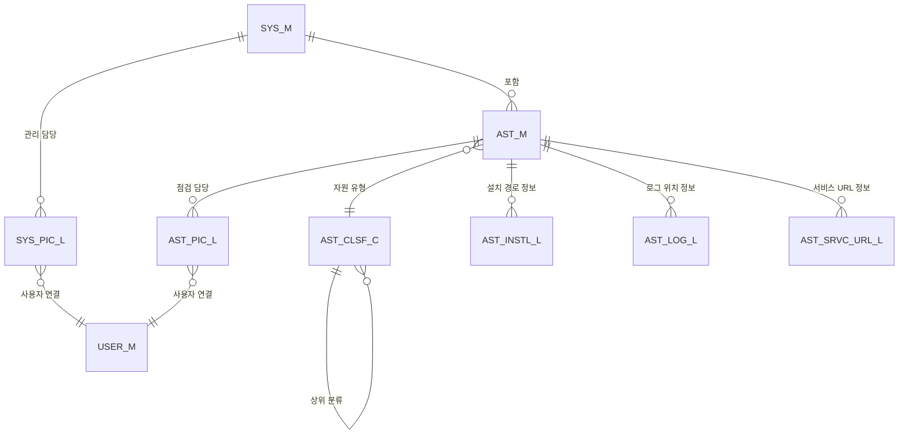
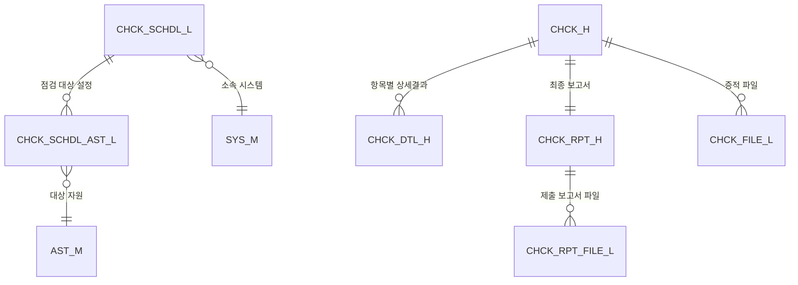
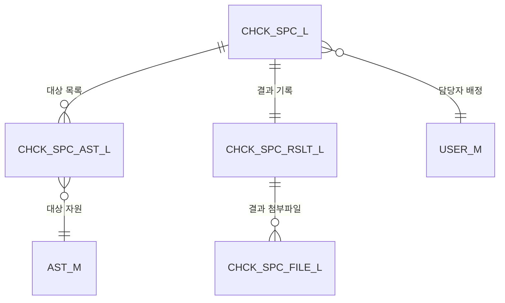
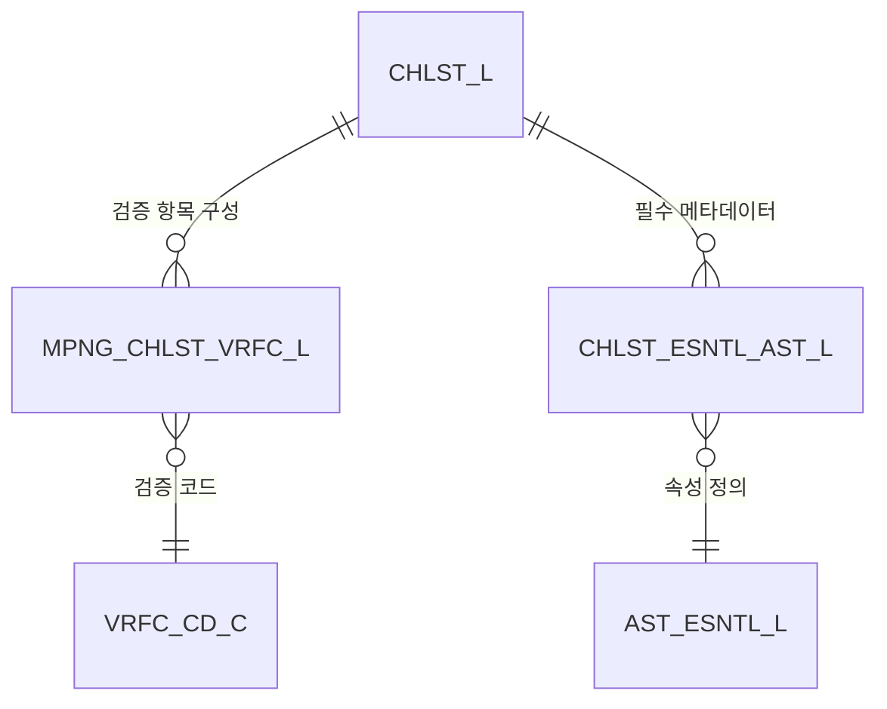

# ComplySight 데이터베이스 엔티티 관계도 (ERD)  
  
이 문서는 `complysight-common` 모듈에 정의된 JPA 엔티티를 기반으로 ComplySight 프로젝트의 데이터베이스 스키마를 시각적으로 표현합니다.  
  
## 통합 엔티티 관계도 (Overall ERD)  

```mermaid  
erDiagram  
    %% 도메인: 사용자 및 권한 (Member & Access)  
    USER_M ||--o{ SYS_PIC_L : "시스템 관리"  
    USER_M ||--o{ AST_PIC_L : "자산 점검"  
    USER_M ||--o{ USER_LOG_H : "로그 기록"  
    USER_M }o--|| USER_TYPE_C : "역할 할당"  
    USER_M }o--|| USER_GROUP_L : "그룹 소속"  
    USER_M }o--|| CD_DTL_C : "근무지/회사"  
  
    %% 도메인: 자산 및 정보시스템 (Asset & System)  
    SYS_M ||--o{ SYS_PIC_L : "담당자 보유"  
    SYS_M ||--o{ AST_M : "자산 포함"  
    SYS_M ||--o{ CHCK_SCHDL_L : "점검 스케줄 설정"  
    AST_M ||--o{ AST_PIC_L : "점검자 보유"  
    AST_M }o--|| AST_CLSF_C : "자원 분류"  
    AST_M ||--o{ AST_INSTL_L : "설치 경로"  
    AST_M ||--o{ AST_LOG_L : "로그 위치"  
    AST_M ||--o{ AST_SRVC_URL_L : "서비스 URL"  
    AST_CLSF_C ||--o{ AST_CLSF_C : "상위 분류 체계"  
  
    %% 도메인: 정기 점검 (Regular Inspection)  
    CHCK_SCHDL_L ||--o{ CHCK_SCHDL_AST_L : "대상 정의"  
    AST_M ||--o{ CHCK_SCHDL_AST_L : "스케줄 할당"  
    CHCK_H ||--o{ CHCK_DTL_H : "상세 결과"  
    CHCK_H ||--o{ CHCK_FILE_L : "첨부 파일"  
    CHCK_H ||--|| CHCK_RPT_H : "보고 이력"  
    CHCK_RPT_H ||--o{ CHCK_RPT_FILE_L : "보고서 파일"  
  
    %% 도메인: 특별 점검 (Special Inspection)  
    CHCK_SPC_L ||--o{ CHCK_SPC_AST_L : "대상 자산"  
    AST_M ||--o{ CHCK_SPC_AST_L : "특별 점검 대상"  
    CHCK_SPC_L ||--|| CHCK_SPC_RSLT_L : "점검 결과"  
    CHCK_SPC_RSLT_L ||--o{ CHCK_SPC_FILE_L : "결과 첨부파일"  
    CHCK_SPC_L }o--|| USER_M : "담당자"  
    CHCK_SPC_L }o--|| CD_DTL_C : "점검 유형"  
  
    %% 도메인: 설정 및 점검표 (Settings & Checklist)  
    CHLST_L ||--o{ MPNG_CHLST_VRFC_L : "검증 항목 매핑"  
    CHLST_L ||--o{ CHLST_ESNTL_AST_L : "필수 속성 정의"  
    CHLST_L ||--o{ AST_M : "자산 연결"  
    MPNG_CHLST_VRFC_L }o--|| VRFC_CD_C : "검증 코드 사용"  
    API_SPCFCT_L ||--o{ API_HEAD_L : "헤더 설정"  
    API_SPCFCT_L ||--o{ API_PARAM_L : "파라미터 설정"  
  
    %% 도메인: 공통 및 로그 (Global & Common)  
    CD_GROUP_C ||--o{ CD_GROUP_C : "그룹 계층"  
    CD_GROUP_C ||--o{ CD_DTL_C : "상세 코드 포함"  
    NTC_M ||--o{ NTC_FILE_L : "공지 첨부파일"  
    ERR_LOG_H }o--|| ERR_TYPE_C : "에러 유형"  
  
    %% 엔티티 상세 정보 (물리 테이블명 및 주요 필드)  
    USER_M {  
        string user_id PK "user_m (사용자 ID)"  
        string user_nm "사용자명"  
        string eml "AES 암호화 (이메일)"  
        string telno "AES 암호화 (전화번호)"  
        string pswd "BCrypt (비밀번호)"  
        int pswd_err_nmtm "오류 횟수"  
        string user_type FK "유형 코드"  
        string powk_cd FK "근무지 코드"  
        string co_cd FK "회사 코드"  
        long group_sn FK "그룹 일련번호"  
        timestamp join_dt "가입일"  
        timestamp pwd_chg_dt "비번 변경일"  
        string del_yn "삭제 여부"  
        timestamp reg_dt "BaseEntity (등록일)"  
        string rgtr_id "BaseEntity (등록자)"  
        timestamp mdfcn_dt "BaseEntity (수정일)"  
        string mdfr_id "BaseEntity (수정자)"  
    }  
  
    SYS_M {  
        string mng_no PK "sys_m (관리번호)"  
        string sys_nm "시스템명"  
        date oper_bgng_ymd "운영 시작일"  
        date oper_end_ymd "운영 종료일"  
        string mnath_cd FK "관리주체 코드"  
        string sys_type FK "시스템 유형"  
        string rsp_pic_nm "책임 담당자"  
        string rsp_pic_telno "담당자 연락처"  
        string del_yn "삭제 여부"  
        string use_yn "사용 여부"  
        timestamp reg_dt "BaseEntity"  
        string rgtr_id "BaseEntity"  
        timestamp mdfcn_dt "BaseEntity"  
        string mdfr_id "BaseEntity"  
    }  
  
    AST_M {  
        long ast_sn PK "ast_m (자원일련번호)"  
        string ast_nm "자원명(호스트)"  
        string up_hst_nm "상위 호스트명"  
        long clsf_sn FK "자원분류 SN"  
        string phys_ip "Physical IP"  
        string srvc_ip "Service IP"  
        string use_ip "사용 IP 내역"  
        string mnath_cd FK "관리주체"  
        string oper_cd FK "운영구분"  
        string use_cd FK "사용상태"  
        string idntf_cd "식별코드"  
        string chlst_cd FK "점검표 코드"  
        string mng_no FK "시스템 번호"  
        string unit_id "Unique (Core 연동 키)"  
        string del_yn "삭제 여부"  
        timestamp reg_dt "BaseEntity"  
        string rgtr_id "BaseEntity"  
        timestamp mdfcn_dt "BaseEntity"  
        string mdfr_id "BaseEntity"  
    }  
  
    AST_CLSF_C {  
        long clsf_sn PK "ast_clsf_c (분류 SN)"  
        string clsf_nm "분류명"  
        long up_clsf_sn FK "상위분류 SN"  
        int sort_seq "정렬순서"  
        string use_yn "사용여부"  
        timestamp reg_dt "BaseEntity"  
        string rgtr_id "BaseEntity"  
        timestamp mdfcn_dt "BaseEntity"  
        string mdfr_id "BaseEntity"  
    }  
  
    CHCK_SCHDL_L {  
        long schdl_sn PK "chck_schdl_l (스케줄 SN)"  
        string schdl_nm "스케줄명"  
        date bgng_ymd "시작일"  
        date end_ymd "종료일"  
        string mng_no FK "시스템 번호"  
        string chck_cycle "SM020 (점검주기)"  
        time chck_tm "점검시간"  
        string use_yn "사용여부"  
        timestamp reg_dt "BaseEntity"  
        string rgtr_id "BaseEntity"  
        timestamp mdfcn_dt "BaseEntity"  
        string mdfr_id "BaseEntity"  
    }  
  
    CHCK_H {  
        long chck_sn PK "chck_h (점검 SN)"  
        timestamp chck_dt "점검일시"  
        string mng_no FK "시스템 번호"  
        string sys_nm "시스템명"  
        long ast_sn FK "자원 SN"  
        string ast_nm "자원명"  
        string chlst_cd FK "점검표 코드"  
        string chck_user_id FK "점검자 ID"  
        string hnwk_yn "육안 점검 여부"  
    }  
  
    CHCK_DTL_H {  
        long dtl_sn PK "chck_dtl_h (상세 SN)"  
        long chck_sn FK "점검 SN"  
        string vrfc_cd "검증 코드"  
        string rslt_vl "점검 결과값"  
        string scs_yn "성공 여부(Y/N)"  
        string agt_type "SM040 (에이전트)"  
    }  
  
    CHCK_SPC_L {  
        long spc_sn PK "chck_spc_l (특별점검 SN)"  
        string ttl "제목"  
        string spc_type FK "특별점검 유형"  
        date term_ymd "점검 기한"  
        string user_id FK "담당자 ID"  
        string pldoc_path "계획서 경로"  
        timestamp reg_dt "BaseEntity"  
        string rgtr_id "BaseEntity"  
        timestamp mdfcn_dt "BaseEntity"  
        string mdfr_id "BaseEntity"  
    }  
  
    CHLST_L {  
        string chlst_cd PK "chlst_l (점검표 코드)"  
        string chlst_nm "점검표명"  
        string chlst_type FK "점검 구분"  
        string use_yn "사용 여부"  
        timestamp reg_dt "BaseEntity"  
        string rgtr_id "BaseEntity"  
        timestamp mdfcn_dt "BaseEntity"  
        string mdfr_id "BaseEntity"  
    }  
  
    VRFC_CD_C {  
        string vrfc_cd PK "vrfc_cd_c (검증 코드)"  
        string vrfc_nm "검증명"  
        string chlst_type FK "점검 구분"  
        string agt_type FK "에이전트 유형"  
        string use_yn "사용 여부"  
        timestamp reg_dt "BaseEntity"  
        string rgtr_id "BaseEntity"  
        timestamp mdfcn_dt "BaseEntity"  
        string mdfr_id "BaseEntity"  
    }  
  
    MPNG_CHLST_VRFC_L {  
        long mpng_sn PK "mpng_chlst_vrfc_l (매핑 SN)"  
        string chlst_cd FK "점검표 코드"  
        string vrfc_cd FK "검증 코드"  
        string crtr_vl "기준값"  
        int sort_seq "정렬 순서"  
        timestamp reg_dt "Auditing"  
        string rgtr_id "Auditing"  
        timestamp mdfcn_dt "Auditing"  
        string mdfr_id "Auditing"  
    }  
  
    CD_DTL_C {  
        string dtl_cd PK "cd_dtl_c (상세코드)"  
        string dtl_nm "코드명"  
        string group_cd FK "그룹코드"  
        int sort_seq "정렬순서"  
        string use_yn "사용여부"  
        timestamp reg_dt "BaseEntity"  
        string rgtr_id "BaseEntity"  
        timestamp mdfcn_dt "BaseEntity"  
        string mdfr_id "BaseEntity"  
    }  
  
    SYS_PIC_L {  
        long pic_sn PK "sys_pic_l (일련번호)"  
        string sys_mng_no FK "시스템 번호"  
        string user_id FK "사용자 ID"  
    }  
  
    AST_PIC_L {  
        long pic_sn PK "ast_pic_l (일련번호)"  
        long ast_sn FK "자원 SN"  
        string user_id FK "사용자 ID"  
    }  
  
    CHCK_SCHDL_AST_L {  
        long schdl_ast_sn PK "chck_schdl_ast_l"  
        long schdl_sn FK "스케줄 SN"  
        long ast_sn FK "자원 SN"  
    }  
  
    CHCK_RPT_H {  
        long chck_sn PK "chck_rpt_h (점검 SN)"  
        string rpt_cycle FK "보고 주기"  
        timestamp rpt_dt "보고 일시"  
        string rptr_id FK "보고자 ID"  
    }  
  
    USER_LOG_H {  
        long hstry_sn PK "user_log_h (이력 SN)"  
        string user_id FK "사용자 ID"  
        timestamp acs_dt "접속 일시"  
        string acsType FK "접속 유형"  
        string acsPath "접속 경로"  
        string acsIp "접속 IP"  
    }  
  
    ERR_LOG_H {  
        long hstry_sn PK "err_log_h (이력 SN)"  
        string err_type FK "에러 유형"  
        string err_cd "에러 코드"  
        string err_ttl "에러 제목"  
        timestamp err_dt "발생 일시"  
    }  
```  
  

  
## 도메인별 세부 관계도  
  
### 1. 자산 및 정보시스템 관리 (Asset & System Management)  
자산이 어떻게 분류되고 정보시스템 아래에 그룹화되는지에 중점을 둡니다.  
  

  
### 2. 정기 점검 및 스케줄링 (Regular Inspection & Scheduling)  
스케줄링 메커니즘과 주기적 점검 결과 기록에 대한 상세 내용입니다.  
  

  
### 3. 특별 점검 (Special Inspection)  
일회성 또는 특정 목적을 위한 점검 프로세스입니다.  
  

  
### 4. 점검표 설정 (Checklist Settings)  
자산 유형별 점검 항목 및 필수 필드 구성 설정입니다.  
  
