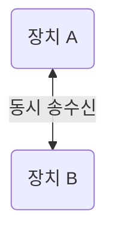
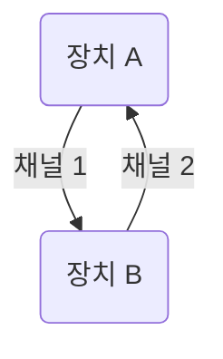
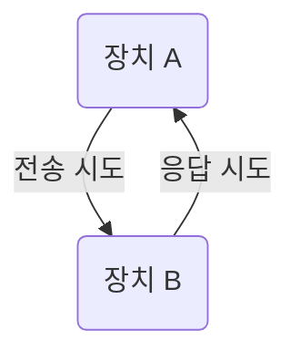
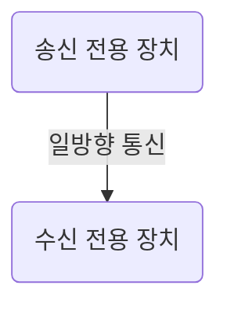

# 전이중 (Full-Duplex)
- 양방향 통신이 동시에 가능하다.

# 이중 단순 (Dual Simplex)
- 양방향 통신은 동시에 가능하지만, 각각 별도의 물리적 채널을 사용한다.

# 반이중 (Half-Duplex)
- 양방향 통신 가능하지만 동시에는 불가능
- 전송과 수신을 순차적으로 해야한다.

# 심플렉스 (Simplex)
- 단방향 통신만 가능하다.
- 수신 장치는 응답할 수 없다.

