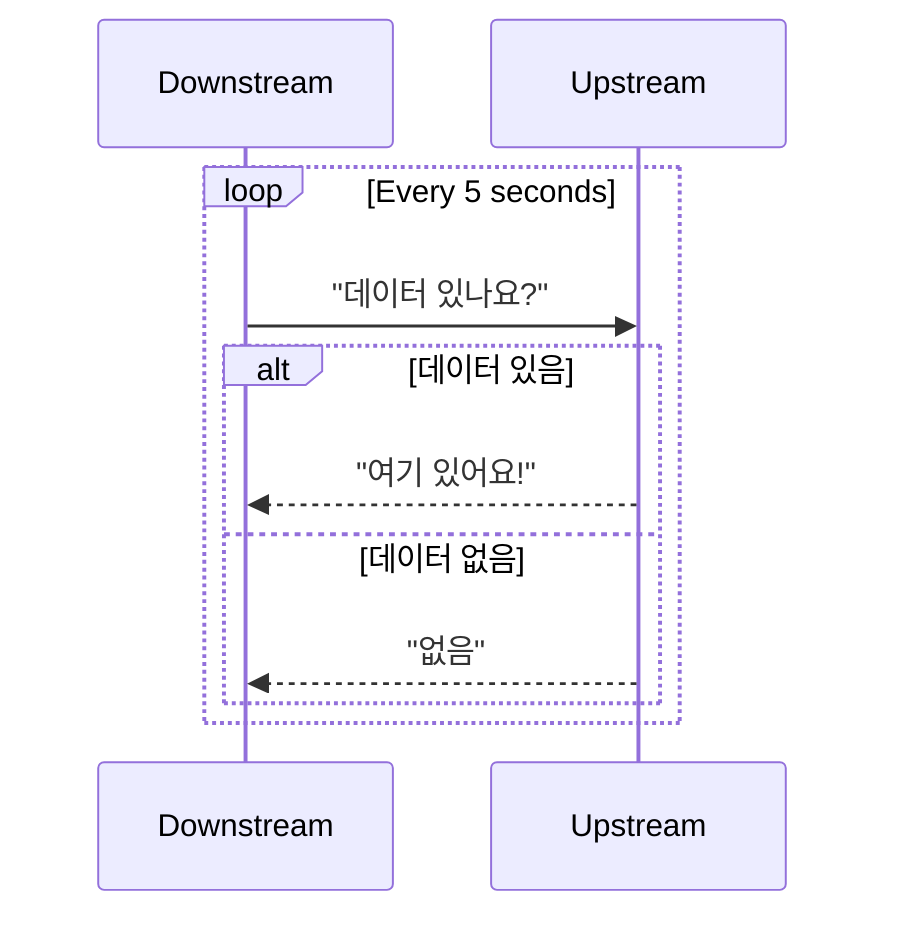

[Long polling: What it is and when to use it](https://sendbird.com/developer/tutorials/what-is-long-polling?utm_source=chatgpt.com)
[웹 브라우저에서 통신 방법(Polling, Long Polling, Streaming, Socket)](https://warmth424.tistory.com/18)
[What is polling technique? Short polling vs long polling](https://ductruong.com/en/blog/2024/04/what-is-polling-technique-short-polling-vs-long-polling/?utm_source=chatgpt.com)
# Polling

- 다운스트림에서 업스트림에 **지속적으로 요청을 보내서** 최신 상태나 데이터를 확인하고, 가능하다면 이를 가져오는 기술
## Advantages
- 간단하고 구현이 쉽다
	- 숏 폴링은 복잡한 설정이 필요하지 않아 배포 및 사용이 용이하다.
- 인터벌 시간 설정이 쉽다.
	- 다운스트림이 짧은 시간 후에 폴링 요청을 보낼 수 있도록 간격 시간을 설정하기가 간단하다.
## Disadvantages
- 지연 시간 증가
	- 다운스트림이 일정 시간이 지난 후에 폴링을 요청을 보내기 때문에, 수신된 데이터가 오래된 것일 수 있고, 이로 인해 최신 데이터 업데이트에 지연이 발생할 수 있다.
- 리소스 낭비
	- 다운스트림이 일정 시간마다 폴링 요청을 보내기 때문에, 그 시간 동안 데이터가 변경되지 않더라도 폴링 요청을 보내기 위해 리소스를 소비해야 한다.
	- 반대로, 그 시간 동안 데이터가 너무 자주 변경될 경우, 업스트림과 다운스트림 모두 대량의 폴링 요청을 처리해야 하므로, 양쪽 모두에서 리소스가 낭비될 수 있다.
# Long Polling
