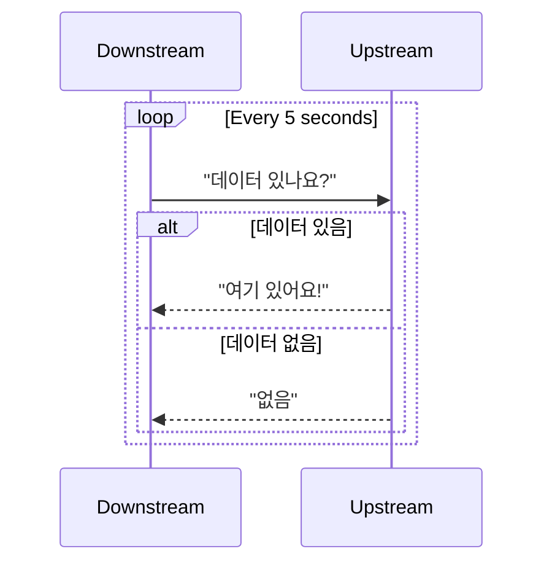

[Long polling: What it is and when to use it](https://sendbird.com/developer/tutorials/what-is-long-polling?utm_source=chatgpt.com)
[웹 브라우저에서 통신 방법(Polling, Long Polling, Streaming, Socket)](https://warmth424.tistory.com/18)
[What is polling technique? Short polling vs long polling](https://ductruong.com/en/blog/2024/04/what-is-polling-technique-short-polling-vs-long-polling/?utm_source=chatgpt.com)
# Polling

- 다운스트림에서 업스트림에 **지속적으로 요청을 보내서** 최신 상태나 데이터를 확인하고, 가능하다면 이를 가져오는 기술
