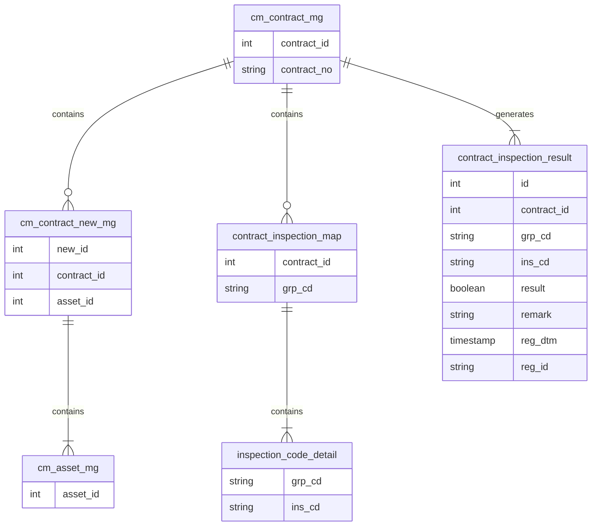

```mermaid
erDiagram

cm_contract_mg ||--o{ cm_contract_new_mg : contains

cm_contract_mg ||--o{ contract_inspection_map : contains

cm_contract_new_mg ||--|{ cm_asset_mg : contains

contract_inspection_map ||--|{ inspection_code_detail : contains

cm_contract_mg ||--|{ contract_inspection_result : generates

  

cm_contract_mg {

int contract_id

string contract_no

}

  

cm_contract_new_mg {

int new_id

int contract_id

int asset_id

}

  

cm_asset_mg {

int asset_id

}

  

contract_inspection_map {

int contract_id

string grp_cd

}

  

inspection_code_detail {

string grp_cd

string ins_cd

}

  

contract_inspection_result {

    int id

    int contract_id
	
	string grp_cd

    string ins_cd

    boolean result

    string remark

    timestamp reg_dtm

    string reg_id

}
```

